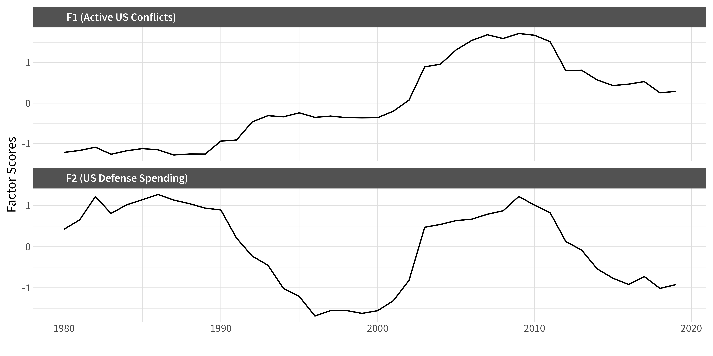
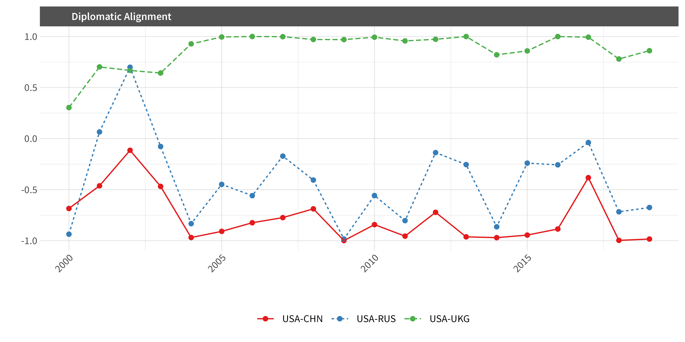

# When America was overstretched, who stayed loyal? Two decades of evidence

*By Ha Eun Choi, Scott de Marchi, Max Gallop, and Shahryar Minhas*

In a recent speech at the World Economic Forum in Davos, Canada's Prime Minister Mark Carney argued that the world has entered a "[rupture](https://www.pm.gc.ca/en/news/speeches/2026/01/20/principled-and-pragmatic-canadas-path-prime-minister-carney-addresses)" in the international order, an end to the "pleasant fiction" that rules are predictable and great powers reliably constrained. That warning has landed amid renewed uncertainty in US foreign policy, with [reports of close US partners exploring warmer engagement with China](https://apnews.com/article/china-trump-europe-allies-trade-greenland-ff445f3c6e2c52d6229d05441aae23f0) despite the political risks. The lesson is clear: international "order" results from strategic choices by nations and may not persist indefinitely. What factors can destabilize existing relationships and cause states to reevaluate their partnerships?

When major powers get tied down, others notice. Syria in December 2024 offers a clear example: Bashar al-Assad was forced from power after Russia, [overstretched by its war in Ukraine](https://www.brookings.edu/articles/the-assad-regime-falls-what-happens-now/), did not reinforce its long-time client. The reversal was swift because other actors could see Russian bandwidth was consumed elsewhere.

In [new research](https://doi.org/10.1017/S0007123424000309) published in the *British Journal of Political Science*, we ask whether a similar dynamic operates in US diplomacy. The answer depends on regime type. When the United States is stretched by costly overseas commitments, autocracies drift toward China diplomatically. Consolidated democracies generally do not. Our evidence covers 2000-2020, so the question now is whether that "democracies hold" pattern persists under new US political conditions.

## Measuring US constraint

Constraint is not the same thing as decline. It is about bandwidth: whether the United States can credibly reassure partners and deter rivals across multiple regions at the same time. From 2000 to 2020, the wars in Afghanistan and Iraq generated clear signals about how stretched Washington was. Troop deployments, casualties, and defense spending all told the same story.

We combine these indicators into two components. One captures active US conflicts and their human costs. The other captures broader defense spending and global force commitments. Both rise sharply after 9/11, peak during the Iraq and Afghanistan wars, and then gradually decline as US attention shifts.

## Measuring diplomatic alignment

We use UN General Assembly voting to map diplomatic alignment, but not in the usual way. Rather than just comparing how two countries vote on the same resolution, we treat the entire voting record as a network. Countries end up closer in this network when they repeatedly side with the same coalitions, even if they are not identical vote-for-vote. The approach picks up indirect ties and broader coalition structures that simpler measures miss.

Consider three relationships. The US-UK relationship remains consistently positive throughout the period. By contrast, US alignment with China and Russia deteriorates sharply after 2003, coinciding with the Iraq war. The brief improvement visible around 2001-2002, in the aftermath of 9/11, reverses quickly as the wars intensify.

## The regime type split

Across 118 countries tracked annually from 2000 to 2020, higher US constraint is associated with closer diplomatic alignment with China, though that aggregate pattern carries considerable uncertainty. The clearer finding emerges when we let the effect vary by regime type.

Autocracies show a clear positive relationship: as US constraint rises, they move closer to China. Mixed regimes follow a similar pattern. Consolidated democracies behave differently. For them, the relationship is near zero or negative, meaning they did not drift toward China when the US was most stretched. In some specifications, democracies actually moved further away.

We find similar results for alignment with Russia, increasing our confidence that this reflects something general about how states respond when a major power's bandwidth contracts.

## Why did democracies stay?

Political scientists have long argued that democracies form more durable alliances. One reason is audience costs: democratic leaders face domestic punishment for abandoning commitments, which makes their promises more credible to partners. Another is institutional binding: the postwar US-led order was designed around institutions and norms that constrained American power in ways that reassured allies. These mechanisms create friction against realignment, even when Washington is stretched thin. Decades of security cooperation have produced military interoperability that would be expensive to replicate. Economic relationships are dense and institutionalized. And domestic audiences in democracies often view visible moves toward authoritarian great powers as politically costly.

Autocracies face a different calculus. With smaller winning coalitions and fewer domestic veto players, their alignment choices can be more transactional and responsive to immediate incentives. Chinese diplomacy offers material benefits without conditions about governance. When US attention is absorbed elsewhere, these governments face fewer costs in hedging toward Beijing.

The "stickiness" of democratic alliances during 2000-2020 may therefore have depended on something specific: the United States being seen as a credible democratic anchor whose commitments were rooted in shared norms rather than purely transactional calculations.

## What happens if the anchor shifts?

Our data end in 2020, so we cannot directly measure the second Trump administration. But the mechanism we identify speaks to current debates.

If US foreign policy becomes more transactional and less democracy-centered, alignment incentives could change. Some authoritarian governments may find Washington easier to deal with, but they may also hedge harder toward China if US commitments look inconsistent.

But the deeper question concerns democratic partners. If democracies stayed close partly because of shared political norms, what happens when those norms appear less central to US foreign policy? Democracy watchdogs have pointed to [erosion of US democratic institutions](https://freedomhouse.org/country/united-states/freedom-world/2025) in recent years. If America's democratic example weakens, democratic partners may find values-based alignment harder to sustain.

This is speculative, and our data cannot test it directly. But it follows from our findings. The pattern we document seems to depend on the United States being seen as a particular kind of partner: one whose reliability stems from institutional commitments rather than calculations that might shift with each administration.

## The policy stakes

The takeaway is not that the United States must avoid overseas commitments. It is that credibility and bandwidth are strategic resources that can be depleted by war, overstretch, and abrupt policy swings.

In a world where China is actively offering governments alternative pathways, preserving US influence is not only about military capacity. It is also about sustaining the predictable commitments and domestic institutions that kept democratic alliances sticky during two decades of constraint. Our findings suggest that democratic governance at home may function as a foreign policy asset, one that helped the United States retain important partners even when its bandwidth was stretched to the limit. Whether that asset continues to operate as it did in the past is now an open question.

---

**Read more**

- *British Journal of Political Science* article: [https://doi.org/10.1017/S0007123424000309](https://doi.org/10.1017/S0007123424000309)
- Replication data (open access): [https://doi.org/10.7910/DVN/EGLKEI](https://doi.org/10.7910/DVN/EGLKEI)
- Code and additional materials: [https://github.com/s7minhas/plutonium](https://github.com/s7minhas/plutonium)
